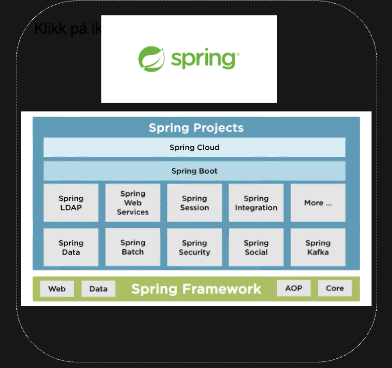
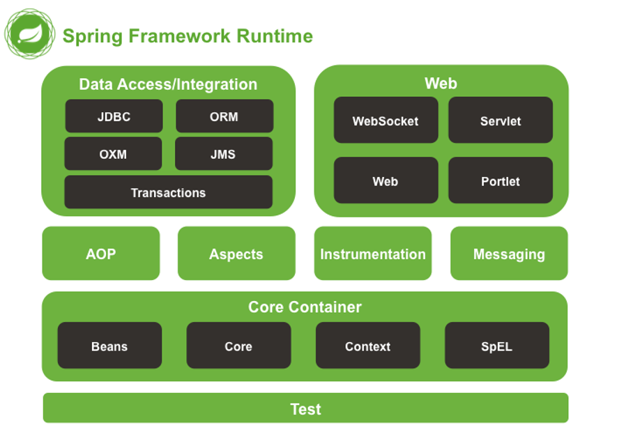

# Spring Boot REST-tjenester Kurs

## 1. Spring Boot Fundamentals

Spring Boot er et populært rammeverk i Java-verdenen som forenkler opprettelsen av standalone, 
production-grade applikasjoner. Det bygger på Spring-rammeverket, men eliminerer mye av 
konfigurasjonen som tradisjonelt har vært nødvendig.


Spring Boot utnytter "convention over configuration" prinsippet gjennom auto-konfigurering. 
Dette betyr at rammeverket gjør kvalifiserte gjetninger om hvilke komponenter som trengs basert 
på avhengigheter som er lagt til i prosjektet. For eksempel, når vi legger til `spring-boot-starter-web` 
i pom.xml, vet Spring Boot at vi ønsker å lage en webtjeneste og konfigurerer automatisk en embedded 
Tomcat-server og andre nødvendige komponenter.


`@SpringBootApplication` annotasjonen kombinerer tre viktige annotasjoner:
- `@Configuration`: Markerer klassen som en konfigurasjonskilde
- `@EnableAutoConfiguration`: Forteller Spring Boot å starte med auto-konfigurering
- `@ComponentScan`: Ber Spring om å lete etter andre komponenter i pakken og underpakker

## 2. REST API Konsepter

REST (Representational State Transfer) er en arkitekturstil for distribuerte systemer. I en REST-API 
representerer hver URL en ressurs, og HTTP-metoder bestemmer operasjonen som utføres på ressursen.

De viktigste HTTP-metodene i en REST-API er:
- GET: Henter informasjon (idempotent)
- POST: Oppretter ny informasjon
- PUT: Oppdaterer eksisterende informasjon (idempotent)
- DELETE: Fjerner informasjon (idempotent)

God navngivning av ressurser er viktig. I vårt eksempel bruker vi `/api/posts/v1` som baseadresse. 
Vi bruker substantiver i flertall (posts) og inkluderer en versjon (v1) for fremtidig kompatibilitet.

HTTP-statuskoder kommuniserer resultat:
- 2xx: Suksess (f.eks. 200 OK, 201 Created)
- 4xx: Klientfeil (f.eks. 400 Bad Request, 404 Not Found)
- 5xx: Serverfeil (f.eks. 500 Internal Server Error)

## 3. Spring MVC Implementasjon

Spring MVC gjør det enkelt å implementere RESTful tjenester. Hovedkomponentene inkluderer:

`@RestController` annotasjonen kombinerer `@Controller` og `@ResponseBody`, og indikerer at 
returverdier skal serialiseres direkte til HTTP-respons. Dette forenkler REST API-utvikling 
sammenlignet med tradisjonelle `@Controller` klasser som returnerer visningsnavn.

Mapping-annotasjoner knytter HTTP-forespørsler til metoder:
- `@RequestMapping`: Generisk mapping, ofte brukt på klassenivå
- `@GetMapping`, `@PostMapping`: Spesifikke for HTTP-metoder, mer lesbare på metodenivå

`@PathVariable` lar oss trekke ut verdier fra URL-en, som vi gjør med post-ID i 
`getPostById(@PathVariable Integer id)`. Dette er essensielt for RESTful ressurs-identifikasjon.

`@RequestBody` forteller Spring å deserialisere forespørselsinnholdet til et Java-objekt, 
som er nødvendig for POST- og PUT-operasjoner.

## 4. Data Modeller

Java records (introdusert i Java 14) er ideelle for DTO-er (Data Transfer Objects) i REST-tjenester. 
De er konsise, immutable og gir automatisk equals(), hashCode() og toString() implementasjoner.

I vårt eksempel har vi to modeller:
- `Post` som representerer fullstendig postinformasjon med ID
- `NewPost` for innkommende data ved opprettelse, uten ID (som genereres på server)

Dette skillet mellom inndata og utdata modeller er en god praksis som:
- Tydeliggjør hvilke felter som er påkrevd ved oppretting
- Forhindrer manipulasjon av serverside-felter (som ID)
- Tilrettelegger for ulik validering av innkommende og utgående data

## 5. Validering

Validering er kritisk for å opprettholde dataintegritet. Spring Boot integrerer sømløst med 
Jakarta Validation API (tidligere Bean Validation).

For å implementere validering trenger vi:
1. Legg til avhengigheten `jakarta.validation-api` i pom.xml
2. Annotere feltene med valideringsannotasjoner som `@NotNull`, `@Size`, `@Email`
3. Aktivere validering med `@Valid` annotasjonen i kontroller-metodene

I vår `NewPost` record bruker vi `@NotNull` for å sikre at ingen felter er null ved oppretting. 
Når en valideringsfeil oppstår, returnerer Spring automatisk en HTTP 400 Bad Request respons.

Valideringsannotasjoner gir også implisitt dokumentasjon om krav til API-forbrukere.

## 6. Tjeneste Lag

Service-laget i Spring-applikasjoner håndterer forretningslogikk, separert fra web-laget (kontrollere). 
Denne separasjonen gjør koden mer:
- Testbar: Tjenester kan testes uten HTTP-kontekst
- Gjenbrukbar: Samme logikk kan brukes av flere kontrollere
- Vedlikeholdbar: Endringer i forretningslogikk påvirker ikke web-laget

`@Service` annotasjonen markerer en klasse som en tjeneste-komponent som Spring automatisk oppdager 
under komponent-skanning.

I vår `PostService`-klasse håndterer vi datalagring og -henting via et Map-objekt. I en reell 
applikasjon ville dette typisk være koblet til en database via et repository-lag.

Dependency Injection (konstruktør-injisering) kobler tjenester til kontrollere automatisk uten 
eksplisitt instansiering, noe som forenkler testing og løser kobling.

## 7. Unntakshåndtering

Robust unntakshåndtering gir bedre brukeropplevelse og forenkler feilsøking. Spring Boot tilbyr 
flere mekanismer for å håndtere unntak elegant:

`@ControllerAdvice` (eller `@RestControllerAdvice`) lar oss definere global unntakshåndtering. 
Kombinert med `@ExceptionHandler` kan vi fange spesifikke unntak og returnere passende HTTP-responser.

For eksempel kan vi håndtere `NoSuchElementException` når en post ikke finnes, og returnere en HTTP 
404 Not Found med en beskrivende melding.

I vår `getPostById` metode kan vi erstatte den direkte Optional-håndteringen med:
```java
return postService.getPostById(id)
    .orElseThrow(() -> new NoSuchElementException("Post med ID " + id + " finnes ikke"));
```

Dette vil, med riktig unntakshåndtering, gi en korrekt 404-respons til klienten.

## 8. Testing

Testing sikrer at API-et fungerer som forventet. Spring Boot tilbyr omfattende teststøtte.

Unit-testing av tjenester fokuserer på forretningslogikk, ofte med mock-objekter for avhengigheter.

Integrasjonstesting av API-er kan gjøres med `@SpringBootTest` og `MockMvc` som simulerer HTTP-forespørsler
uten å faktisk starte en server.

For manuell testing kan HTTP-klientfiler (som `.http` eller Postman-samlinger) gjøre det enkelt å
utforske og verifisere API-et. Vår `api.http` fil inneholder eksempler på forespørsler som kan
kjøres direkte fra IDE-en.

Testdrevet utvikling (TDD) er spesielt effektivt for API-utvikling, der vi kan definere forventet
oppførsel gjennom tester før implementering.

## 9. Veien Videre

Etter å ha mestret grunnleggende REST-tjenester med Spring Boot, er det flere avanserte områder å utforske:

Databaseintegrasjon med Spring Data JPA eller JDBC forenkler persistens og lar oss erstatte
in-memory Map med en reell database.

Sikkerhet er kritisk for de fleste API-er. Spring Security tilbyr autentisering og autorisasjon
med støtte for ulike sikkerhetsprotokoller som OAuth2 og JWT.

API-dokumentasjon med Swagger/OpenAPI genererer interaktiv dokumentasjon som gjør det enkelt for
klienter å forstå og bruke API-et.

Cacheing, rate-limiting og paginering er viktige for å bygge skalerbare og ytelseseffektive API-er
som håndterer stor trafikk.

Distribuerte systemer med Spring Cloud kan integrere tjenester med service discovery, konfigurasjonsstyring
og lastbalansering.
